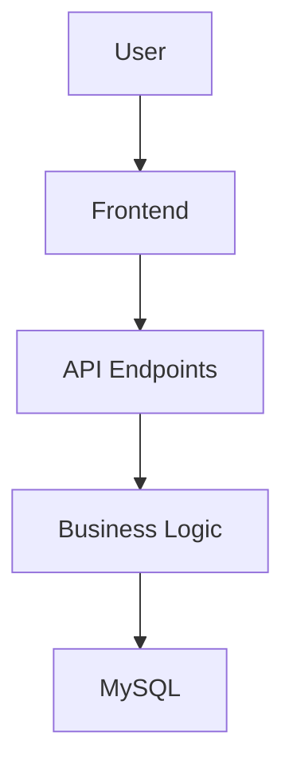

# 🏖️ Time-Off Manager


[](https://opensource.org/licenses/MIT)

## 🌟 Overview

The Time-Off Manager is a full-stack application designed to manage employee vacations and time-off requests. It consists of a backend API built with Java and Spring Boot, and a frontend built with React. The system ensures role-based access control and integrates seamlessly with a MySQL database.



## 🚀 Features

### 📋 Core Operations

- **Collaborators**:
  - Create, update, and delete collaborators.
  - Retrieve a list of collaborators.

- **Vacations**:
  - Submit vacation requests.
  - Approve or reject vacation requests.
  - Retrieve vacation history.

- **Authentication**:
  - Role-based access control (ADMIN, MANAGER, COLLABORATOR).
  - JWT-based authentication.

## 🛡️ Business Rules

### General Rules
- **Roles**:
  - `ADMIN`: Can create and manage all users and vacation requests.
  - `MANAGER`: Can manage collaborators and approve/reject vacation requests for their team members.
  - `COLLABORATOR`: Can create and manage only their own vacation requests.

### Collaborators
- Only `ADMIN` can create, edit, and delete collaborators.
- Each collaborator must be associated with a manager.
- `MANAGER` cannot create users but can manage vacation requests of their team members.

### Vacation Requests
- **Creation**:
  - Vacation requests must be for dates after the current date.
  - Collaborators cannot create vacation requests if there is already an approved request for the same period.
  - Collaborators cannot create a new vacation request if there is a pending request for the same period.
  - The maximum vacation duration is 30 days.
- **Approval/Rejection**:
  - Only `MANAGER` or `ADMIN` can approve/reject vacation requests.
  - `MANAGER` can only approve/reject requests for their team members.
- **Editing/Canceling**:
  - Vacation requests can only be edited or canceled if they have not started yet.
- **Validation**:
  - Overlapping vacation requests are not allowed for the same collaborator.
  - Dates are inclusive (e.g., 01/08 to 05/08 includes all 5 days).

### Status
- Vacation requests have the following statuses:
  - `PENDING`: Awaiting approval.
  - `APPROVED`: Approved by a manager or admin.
  - `REJECTED`: Rejected by a manager or admin.

## 🛠️ Tech Stack

- **Backend**: Java 21, Spring Boot 3.x
- **Frontend**: React 18+, JavaScript (ES6+)
- **Database**: MySQL 8
- **State Management**: Context API
- **Routing**: React Router
- **Styling**: CSS Modules
- **Containerization**: Docker, Docker Compose
- **Authentication**: JWT

## 🚀 Quick Start

### Prerequisites

- **🐳 Docker Desktop (or Docker Engine + Compose)**
- **☕ Java 21+ JDK**
- **🖥️ Node.js 18+**

### Running with Docker Compose

1. Clone the repository:
   ```bash
   git clone https://github.com/gibranmenezes/time-off-manager.git
   cd time-off-manager
   ```

2. Start the system:
   ```bash
   docker-compose up -d
   ```

3. Verify containers:
   ```bash
   docker ps -a
   ```

4. Access the application:
   - **Frontend**: Open your browser and navigate to: `http://localhost:3000`
   - **API**: Swagger UI available at: `http://localhost:8080/swagger-ui.html`

5. Stop containers:
   ```bash
   docker-compose down
   ```

---

## 🔗 URLs

- **Frontend**: `http://localhost:3000`
- **API**: `http://localhost:8080`

---

## 🐧 Installing Docker on Linux

1. Update the package index:
   ```bash
   sudo apt-get update
   ```

2. Install required packages:
   ```bash
   sudo apt-get install -y apt-transport-https ca-certificates curl software-properties-common
   ```

3. Add Docker’s official GPG key:
   ```bash
   curl -fsSL https://download.docker.com/linux/ubuntu/gpg | sudo gpg --dearmor -o /usr/share/keyrings/docker-archive-keyring.gpg
   ```

4. Set up the stable repository:
   ```bash
   echo "deb [arch=$(dpkg --print-architecture) signed-by=/usr/share/keyrings/docker-archive-keyring.gpg] https://download.docker.com/linux/ubuntu $(lsb_release -cs) stable" | sudo tee /etc/apt/sources.list.d/docker.list > /dev/null
   ```

5. Install Docker Engine:
   ```bash
   sudo apt-get update
   sudo apt-get install -y docker-ce docker-ce-cli containerd.io
   ```

6. Verify installation:
   ```bash
   docker --version
   ```

7. Install Docker Compose:
   ```bash
   sudo curl -L "https://github.com/docker/compose/releases/download/v2.20.2/docker-compose-$(uname -s)-$(uname -m)" -o /usr/local/bin/docker-compose
   sudo chmod +x /usr/local/bin/docker-compose
   ```

8. Verify Docker Compose installation:
   ```bash
   docker-compose --version
   ```

---

## 🪟 Installing Docker on Windows

1. Download Docker Desktop from the [official website](https://www.docker.com/products/docker-desktop).
2. Run the installer and follow the setup instructions.
3. After installation, open Docker Desktop and ensure it is running.
4. Verify installation:
   ```bash
   docker --version
   docker-compose --version
   ```